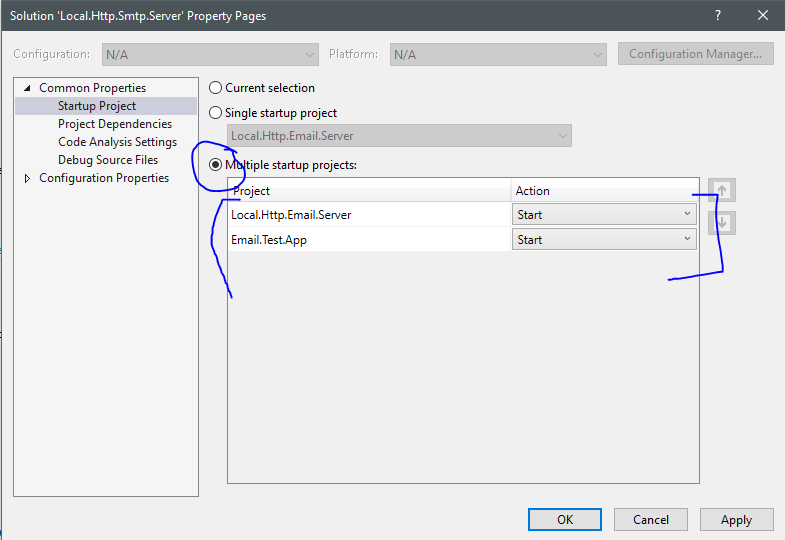
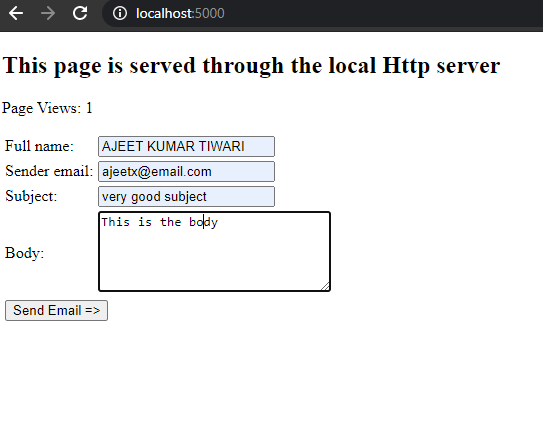

# Local Http & Smtp Server     

A basic http server to serve http request and,
A simple SMTP server to receive email


## Repository codebase
 
The repository consists of projects as below:


| # |Project Name | Project detail | location| Environment |
| ---| ---  | ---           | ---          | --- |
| 1 | Local.Http.Smtp.Server | Dotnet5 console app  |  **Local.Http.Smtp.Server** folder | [](https://dotnet.microsoft.com/download/dotnet/5.0)|
| 2 | Email.Test.App | Azure function to send email |  **Email.Test.App** folder | [](https://dotnet.microsoft.com/download/dotnet/5.0)| 

### Summary

The overall objective of the applications :

```

>   A user can browse to "http://localhost:5000/". 
>   The page is served through the **http server**. 
>   The console application logs the browsing.
>   User can send email and see the logs within the console.

```

### Setup detail


> Download/install   	
>	1.	[](https://dotnet.microsoft.com/download/dotnet/5.0) to run webapi project
>   
>   2. [](https://visualstudio.microsoft.com/downloads//) to run/debug the applications
>   Or [](https://code.visualstudio.com/) to run/debug the applications
>	
>   


##### Project Setup detail

>   1. Please clone or download the repository from [](https://github.com/AJEETX/Local.Http.Smtp.Server) 
>   
>   2. Create a folder and place the downloaded repository and unzip if downloaded.
>   
>   3. Open the solution file through **Visual Studio2019** where the repository is downloaded
>   
##### (a) To start the webapi
   
>   1. Through **Visual Studio2019**, click **F5** button to run the **http server** & **smtp server**, Please make sure to select as **multiple-startup-project**.

*********************************************************************************************



*********************************************************************************************
>   
>   3. **http server** shall start running on port **5000**
>
>   4. **smtp server** shall start running on port **25**
>

*********************************************************************************************


*********************************************************************************************
>
>   5. open a browser with url as **http://localhost:5000**
>   
 *********************************************************************************************



*********************************************************************************************
>
>   5. The http request/response is logged on the console.
>   6. Then email received is logged on the console
>   
 *********************************************************************************************


*********************************************************************************************
```
For better experience please use chrome browser
```
-----------------------------------------------------------------------


  | ||
 | --- | --- | ---|


