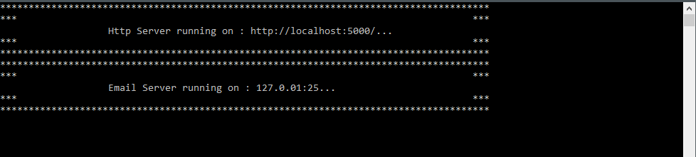

# Local Http & Smtp Server     

A basic http server to serve http request and,
A simple SMTP server to receive email


*********************************************************************************************



*********************************************************************************************

## Repository codebase
 
The repository consists of projects as below:


| # |Project Name | Project detail | location| Environment |
| ---| ---  | ---           | ---          | --- |
| 1 | Local.Http.Smtp.Server | Dotnet5 console app  |  **Local.Http.Smtp.Server** folder | [](https://dotnet.microsoft.com/download/dotnet/5.0)|
| 2 | Email.Test.App | Azure function |  **Email.Test.App** folder | [](https://dotnet.microsoft.com/download/dotnet/5.0)| 

### Summary

The overall objective of the applications :
```
>	A user can browse to "http://localhost:5000/". The page is served through the **http server**. The console application logs the browsing.
>	User can send email and see the logs within the console.
```

### Setup detail

##### Environment Setup detail

> Download/install   	
>	1.	[](https://dotnet.microsoft.com/download/dotnet/5.0) to run webapi project
>   
>   2. [](https://visualstudio.microsoft.com/downloads//) to run/debug the applications
>   Or [](https://code.visualstudio.com/) to run/debug the applications
>	
>   

-----------------------------------------------------------------------
  | ||
 | --- | --- | ---|


